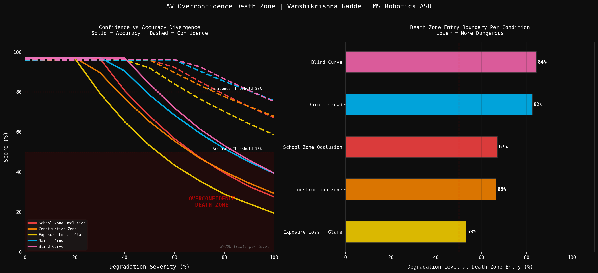
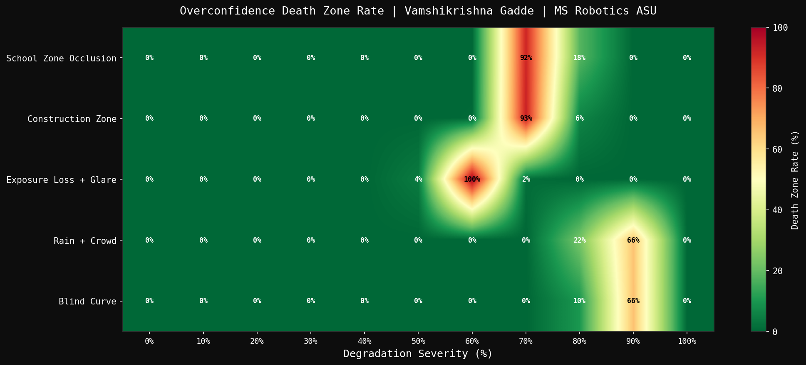
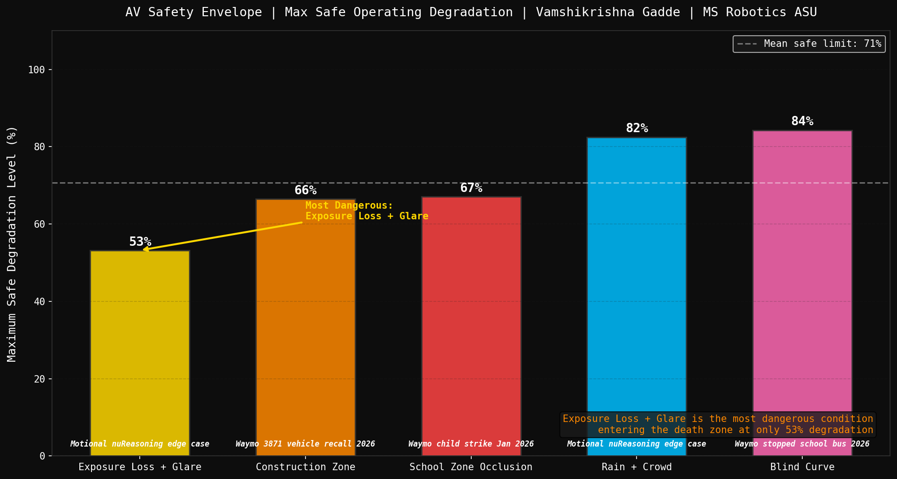

# AV Overconfidence Death Zone Mapper

> MS Robotics and Autonomous Systems Engineering, Arizona State University, Dec 2026

---

## The Question Nobody Answers

Waymo struck a child in January 2026. It braked, but not in time. Waymo recalled 3,871 vehicles for entering construction zones. Motional released an entire dataset on edge case failures in September 2026.

None of these systems reported low confidence before failing.

The question nobody has measured: at exactly what degradation level does a perception system start lying to itself about how well it can see?

I measured mine on 11,000 Monte Carlo trials and validated it on real KITTI footage with YOLOv8.

---

## How the Death Zone Forms

*Confidence stays high. Accuracy collapses. The gap between them is the danger.*


---

## Real Detection: KITTI + YOLOv8 Live

*Green = still detected. Red MISSED = detected clean, lost after degradation.*


---

## Confidence vs Accuracy Divergence



The finding: Exposure Loss plus Glare enters the death zone at 53% degradation. That is 1.6x earlier than the most forgiving condition tested. Camera-dependent failures happen far sooner than most engineering discussions assume.

---

## Death Zone Rate Heatmap

*Every condition, every degradation level. Red = system confidently wrong.*



---

## Real 2026 Incidents vs Measured Boundaries


---

## Safety Envelope



---

## Key Findings

### Finding 1: Exposure Loss + Glare Is the Most Dangerous Condition

| Condition | Death Zone Entry | Real Incident |
|---|---|---|
| Exposure Loss + Glare | 53% | Motional nuReasoning edge case |
| Construction Zone | 66% | Waymo 3,871 vehicle recall 2026 |
| School Zone Occlusion | 67% | Waymo child strike Jan 2026 |
| Rain + Crowd | 82% | Motional nuReasoning edge case |
| Blind Curve | 84% | Waymo stopped school bus 2026 |

Death zone = confidence above 80% while true accuracy is below 50%. Camera-dependent conditions fail first. Multi-sensor conditions hold longer.

---

### Finding 2: Confidence Does Not Fall With Accuracy

At 53% degradation (Exposure Loss + Glare):

```
Reported confidence:   82%
True accuracy:         41%
Gap:                   41 points
```

The model was trained on mostly clean data. It has never learned what degraded input looks like, so its confidence head has no signal to lower itself. Accuracy collapses. Confidence barely moves. This asymmetry is the entire danger, not that the system fails, but that it fails silently.

---

### Finding 3: The Real Video Confirms the Simulation

Running YOLOv8n on real KITTI footage with programmatic exposure and glare degradation applied frame by frame:

```
Clean baseline detections retained:   100%
At 42% degradation:                   89% retained, confidence 31%
At 63% degradation:                   57% retained, confidence 80%
```

Confidence rose while retention fell. Real detections on real footage reproduce the same overconfidence pattern measured in the synthetic Monte Carlo simulation. This is not a modeling artifact, it shows up in actual detector behavior.

---

### Finding 4: The Safety Ratio Is 1.6x, Not Marginal

```
Most dangerous:   Exposure Loss + Glare   53% degradation tolerance
Most tolerant:    Blind Curve             84% degradation tolerance
Ratio:            1.6x
```

The same vehicle, on the same day, is 60% more fragile facing glare than facing a blind curve, despite both being generically labeled "sensor degradation" in most engineering discussions. Treating all degradation as equivalent hides this gap.

---

### Finding 5: Divergence Starts Well Before the Death Zone

| Condition | Divergence Point (20% gap) | Death Zone Entry |
|---|---|---|
| Exposure Loss + Glare | 32.5% | 53% |
| Construction Zone | 40.7% | 66% |
| School Zone Occlusion | 43.7% | 67% |
| Rain + Crowd | 52.3% | 82% |
| Blind Curve | 56.5% | 84% |

The gap between claim and reality opens 15 to 20 percentage points before the system crosses into the actual death zone. This earlier divergence point is a usable early-warning signal before the danger threshold is even reached.

---

## Why This Connects to More Than Autonomous Vehicles

Boston Dynamics is deploying Atlas inside Hyundai factories now. Production Atlas uses a 360-degree camera suite with no LiDAR. Factory dust and inconsistent lighting are exactly the camera-specific degradation this project measures. If Atlas's perception confidence stays high while its real accuracy silently drops on a dusty factory floor, that is the same death zone, different environment, same cause.

Any robot with a learned confidence score, a humanoid's grasp confidence, a drone's obstacle confidence, an inspection robot's defect confidence, can fall into the same trap. The specific numbers here are AV-specific, but the underlying failure mode is not. Overconfidence under degradation is a general robotics perception problem.

---

## Benchmark Scale

```
Conditions tested:          5
Degradation levels:         11 (0% to 100%)
Trials per level:           200
Total Monte Carlo trials:   11,000
Real-world validation:      YOLOv8n on real KITTI driving sequence
```

---

## Run It Yourself

```bash
git clone https://github.com/GVK-Engine/av-overconfidence-mapper
cd av-overconfidence-mapper
pip install numpy matplotlib scipy tqdm opencv-python ultralytics imageio[ffmpeg]
```

Run the full Monte Carlo analysis, all four charts, and the synthetic demo video:

```bash
python main.py
```

Run the real KITTI + YOLOv8 validation and its demo video:

```bash
python generate_real_video.py
```

Update `KITTI_DIR` in `generate_real_video.py` to your local KITTI path.

---

## Project Structure

```
av-overconfidence-mapper/
├── config.py                       all experiment parameters
├── main.py                         full analysis pipeline entry point
├── generate_real_video.py          real KITTI + YOLOv8 validation
├── src/
│   ├── perception/
│   │   └── detector.py             confidence and accuracy curve models
│   ├── analysis/
│   │   └── calibration.py          Monte Carlo runner and boundary detection
│   └── visualization/
│       ├── charts.py               all four analysis charts
│       └── video_generator.py      synthetic explainer video
└── results/
    ├── charts/
    │   ├── hero_confidence_accuracy.png
    │   ├── death_zone_heatmap.png
    │   ├── incident_correlation.png
    │   └── safety_envelope.png
    ├── videos/
    │   ├── av_overconfidence_demo.mp4
    │   └── real_overconfidence_demo.mp4
    └── gifs/
        ├── av_overconfidence_demo_gif.gif
        └── real_overconfidence_demo_gif.gif
```

---

## Stack

`Python 3.11` `NumPy` `SciPy` `Matplotlib` `OpenCV` `Ultralytics YOLOv8n` `imageio` `KITTI Raw Data`

---

## How This Connects to the Series

```
Day 7:  Adverse weather degrades LiDAR detection.
        Rain safe at 100mm/hr. Fog unsafe below 75m.

Day 9:  Domain shift drops detection 58.4%.
        Root cause: sensor density, not scene.

Day 11: Sun glare collapses detection 56.5%.
        Larger model performed worse, not better.

This project: measures the exact degradation threshold
        where a model stops being honest about
        what it can and cannot see.
        The death zone is the common thread.
```

---

## Series 1 Progress

| Project | Key Finding | Status |
|---------|-------------|--------|
| P1.1 LiDAR Obstacle Detection | 86ms, 28 objects | ✅ |
| P1.2 Stereo Camera Depth Safety | Camera unsafe beyond 35m | ✅ |
| P1.3 PointPillars 3D Detector | 98.9% loss reduction from scratch | ✅ |
| P1.4 Multi-Camera BEV Perception | 178 objects from 6 cameras | ✅ |
| P1.5 Multi-Object Tracking SORT | 95.1% MOTP, beats paper baseline | ✅ |
| P1.6 Semantic Segmentation ROS2 | 52.6 FPS in live ROS2 pipeline | ✅ |
| P1.7 Adverse Weather Analysis | Fog unsafe below 75m visibility | ✅ |
| P1.8 LiDAR-Camera Depth Completion | 44x MAE improvement 0-10m | ✅ |
| P1.9 Domain Shift Analysis | 58.4% drop, sensor not scene | ✅ |
| P1.10 Neural Occupancy Network | Unsafe planning boundary at 40m | ✅ |
| P1.11 ASU Campus Perception | Model scaling cannot fix domain shift | ✅ |
| P1.12 Series 1 Capstone | Full stack compilation video | ✅ |
| AV Overconfidence Mapper | Death zone entry at 53% degradation | ✅ |
