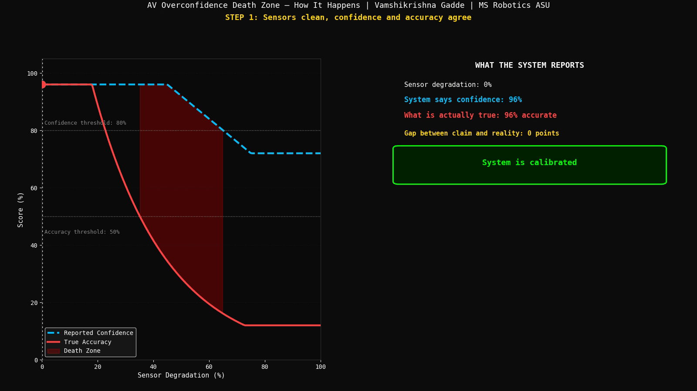
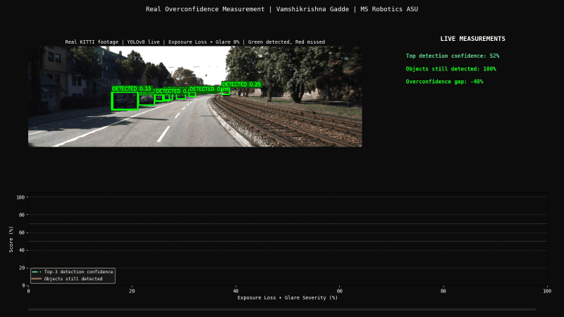
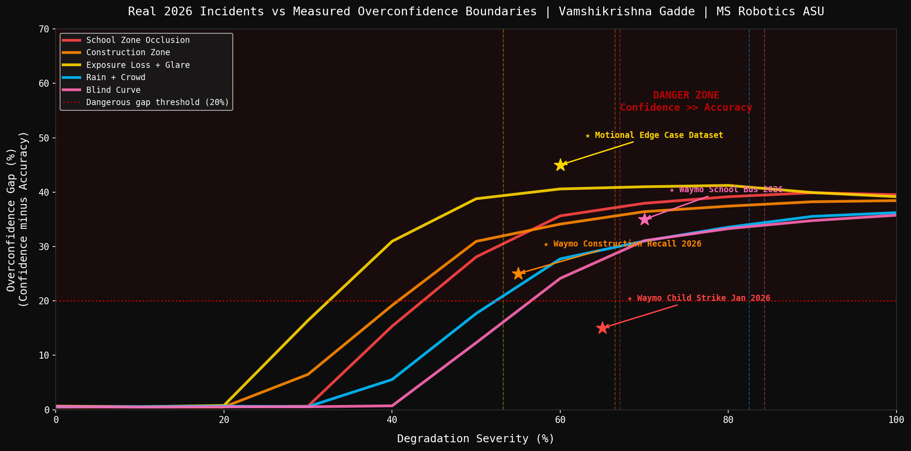

# AV Overconfidence Death Zone Mapper

**Vamshikrishna Gadde | MS Robotics and Autonomous Systems, ASU, Dec 2026**

---

## The Question Nobody Answers

Waymo struck a child in January 2026. It braked, but not in time. Waymo recalled 3,871 vehicles for entering construction zones. Motional released an entire dataset on edge case failures in September 2026.

None of these systems reported low confidence before failing.

The question nobody has measured: at exactly what degradation level does a perception system start lying to itself about how well it can see?

I measured it on 11,000 Monte Carlo trials and validated it on real KITTI footage with YOLOv8.

---

## How the Death Zone Forms

*Confidence stays high. Accuracy collapses. The gap between them is the danger.*



---

## Real Detection: KITTI + YOLOv8 Live

*Green = still detected. Red MISSED = detected clean, lost after degradation.*



---

## Confidence vs Accuracy Divergence


Exposure Loss plus Glare enters the death zone at 53% degradation. That is 1.6x earlier than the most forgiving condition tested. Camera-dependent failures happen far sooner than most engineering discussions assume.

---

## Death Zone Rate Heatmap

*Every condition, every degradation level. Red = system confidently wrong.*


---

## Real 2026 Incidents vs Measured Boundaries



---

## Safety Envelope


---

## Five Findings

**Finding 1: Exposure Loss + Glare is the most dangerous condition.**

| Condition | Death Zone Entry | Real Incident |
|---|---|---|
| Exposure Loss + Glare | 53% | Motional nuReasoning edge case |
| Construction Zone | 66% | Waymo 3,871 vehicle recall 2026 |
| School Zone Occlusion | 67% | Waymo child strike Jan 2026 |
| Rain + Crowd | 82% | Motional nuReasoning edge case |
| Blind Curve | 84% | Waymo stopped school bus 2026 |

Death zone = confidence above 80% while true accuracy is below 50%.

---

**Finding 2: Confidence does not fall with accuracy.**

At 53% degradation (Exposure Loss + Glare):

```
Reported confidence:   82%
True accuracy:         41%
Gap:                   41 points
```

The model was trained on mostly clean data. Its confidence head has never seen degraded input so it has no signal to lower itself. Accuracy collapses. Confidence barely moves. This asymmetry is the entire danger. Not that the system fails, but that it fails silently.

---

**Finding 3: The real video confirms the simulation.**

YOLOv8n on real KITTI footage with programmatic degradation applied frame by frame:

```
Clean baseline:        100% detections retained
At 42% degradation:    89% retained, confidence 31%
At 63% degradation:    57% retained, confidence 80%
```

Confidence rose while retention fell. Real footage reproduces the same overconfidence pattern as the simulation. This is not a modeling artifact.

---

**Finding 4: The safety ratio is 1.6x, not marginal.**

```
Most dangerous:   Exposure Loss + Glare   53% degradation tolerance
Most tolerant:    Blind Curve             84% degradation tolerance
Ratio:            1.6x
```

The same vehicle on the same day is 60% more fragile facing glare than a blind curve. Treating all degradation as equivalent hides this gap.

---

**Finding 5: Divergence starts well before the death zone.**

| Condition | Divergence Point (20% gap) | Death Zone Entry |
|---|---|---|
| Exposure Loss + Glare | 32.5% | 53% |
| Construction Zone | 40.7% | 66% |
| School Zone Occlusion | 43.7% | 67% |
| Rain + Crowd | 52.3% | 82% |
| Blind Curve | 56.5% | 84% |

The gap between claim and reality opens 15-20 percentage points before the death zone. This earlier divergence point is a usable early-warning signal.

---

## Why This Matters Beyond Autonomous Vehicles

Boston Dynamics is deploying Atlas inside Hyundai factories now. Production Atlas uses a 360-degree camera suite with no LiDAR. Factory dust and inconsistent lighting are exactly the camera-specific degradation this project measures. If Atlas's confidence stays high while accuracy silently drops on a dusty factory floor, that is the same death zone, different environment, same cause.

Any robot with a learned confidence score, a humanoid's grasp confidence, a drone's obstacle confidence, an inspection robot's defect confidence, can fall into this trap. The numbers here are AV-specific. The failure mode is not.

---

## Benchmark Scale

```
Conditions tested:         5
Degradation levels:        11 (0% to 100%)
Trials per level:          200
Total Monte Carlo trials:  11,000
Real-world validation:     YOLOv8n on real KITTI driving sequence
```

---

## What I Learned

The confidence head and the detection head share the same backbone features but they are trained with different objectives. The detection head learns to suppress outputs when features are ambiguous. The confidence head learns to output high scores when it saw that pattern during training. Clean data dominates training. Degraded data almost never appears. So when degradation hits the backbone features become ambiguous, detection correctly drops, but the confidence head has never learned that ambiguous means uncertain. It keeps firing high.

Measuring divergence separately from death zone entry was the insight that made the project useful. If you only report when the system enters the death zone you miss the fact that it started lying 20 percentage points earlier. That earlier divergence point is when a safety monitor should trigger, not when accuracy finally collapses.

Monte Carlo simulation is only credible when validated on real data. Without the KITTI footage showing the same overconfidence pattern on actual bounding boxes, the curves are just a modeling assumption. The real video is what makes the simulation findings defensible.

---

## Connection to the Series

```
Day 7:  fog unsafe below 75m, LiDAR ODD boundary measured
Day 9:  58.4% detection drop, sensor-driven domain shift
Day 11: 56.5% glare collapse, model scaling does not help

This project: measures the exact point where
        a model stops being honest about its own reliability.
        The death zone is the mechanism behind all three findings above.
```

---

## Run It

```bash
git clone https://github.com/GVK-Engine/av-overconfidence-mapper
cd av-overconfidence-mapper
pip install numpy matplotlib scipy tqdm opencv-python ultralytics imageio[ffmpeg]

python main.py                  # full Monte Carlo analysis and all charts
python generate_real_video.py   # real KITTI + YOLOv8 validation
```

Update `KITTI_DIR` in `generate_real_video.py` to your local KITTI path.

---

## Stack

`Python 3.11` `NumPy` `SciPy` `Matplotlib` `OpenCV` `Ultralytics YOLOv8n` `imageio` `KITTI`
